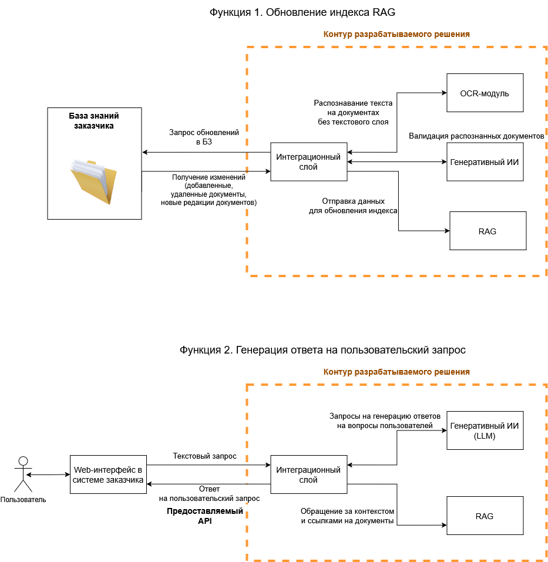

## Задача
Проект по созданию ИИ-помощника для ответов на вопросы по базе знаний заказчика.

## Моя роль
Проводил интервью заказчиков, описывал функциональные требования, нефункциональные требования, пользовательские сценарии. На основе требований готовил артефакты - контекстную диаграмму и ТЗ для заказчика.

## Артефакты

- [Исходный файл диаграммы](./diagrams/rag-llm-бз.drawio)

## Инструменты
draw.io, Jira, Confluence
