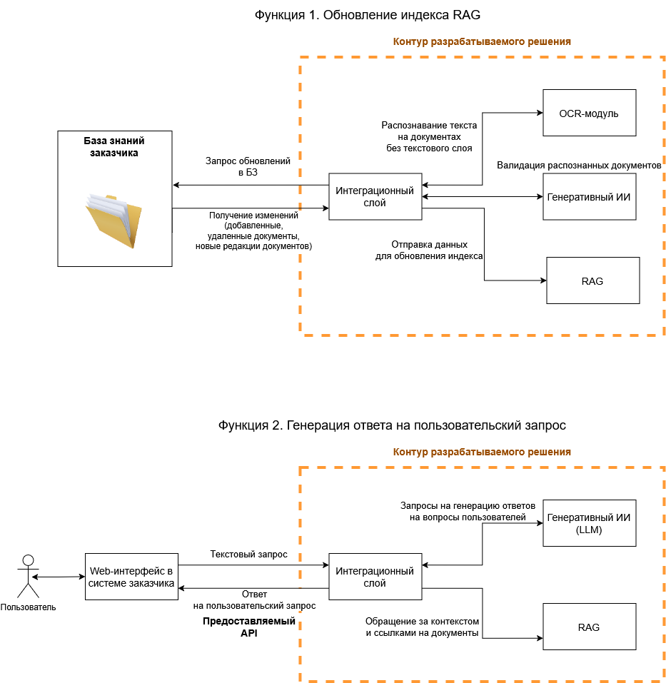

## Задача
Проект по созданию ИИ-помощника для ответов на вопросы по базе знаний заказчика.

## Моя роль
* Проводил интервью заказчиков
* Описывал функциональные и нефункциональные требования
* Описывал пользовательские сценарии
* Готовил артефакты - контекстную диаграмму и ТЗ для заказчика

## Артефакты
**Контекстная диаграмма**

- [Исходный файл диаграммы](./diagrams/rag-llm-бз.drawio)

## Пример требований
### Нефункциональные требования
|Категория|Требование|
|-|-|
|Доступность|Система должна быть доступна 24 часа 7 дней в неделю|
|Доступность|Система должна обеспечивать работу с уровнем надёжности (SLA) 99%|
|Производительность|При одновременном количестве в 250 пользовательских сессий на запрос в 250 символов система должна возвращать ответ за 5 секунд|
|Безопасность|Аутентификация пользователей выполняется через корпоративную систему заказчика|
|Логирование|Все запрос и ответы должны логироваться для аудита|
|Логирование|Логи вопросов и ответов должны храниться в течение 3 месяцев|
|Точность|Процент релевантных ответов должно составлять не менее 90%|
|Генерация ответов|Ассистент должен поддерживать контекстное окно в 10 пар "вопрос-ответ"|
|Масштабируемость|Система должна быть способна сохранять требования производительность при увеличении числа одновременных пользователей до 1000 в течение 5 лет|
|Поддержка данных|Система должна поддерживать форматы документво docx/doc, txt, pdf, в том числе без текстового слоя|
|Поддержка данных|Система должна поддерживать объём базы знаний в 12Гб|

Требования к удобству использования и совместимости не предоставляются, так как пользовательский интерфейс реализуется на сторорне Заказчика.

### Функциональные требования
#### 1. Индексация базы знаний
* При первом запуске система должна производить индексацию базы знаний.
* Индексация базы знаний должна происходить ежедневно и поддерживать добавление, изменение и удаление документов.
* Система должна распознавать текст на документах без текстового слоя через OCR-сервис
* Распознанный текст должен валидироваться с помощью LLM

#### 2. Генерация ответов
* Система должна принимать текстовые запросы через API.
* Система должна проирндексировать входящий запрос и обратиться в RAG-индекс за контекстом и ссылками на документы.
* Система должна передать запрос и контекст на генерацию ответа в LLM и вернуть ответ пользователю
* Система должна возвращать ответ со ссылками на документы

#### 3. Ограничения
* Система должна отвечать только на вопросы, связанные с документами в базе знаний и доменной областью Заказчика
* Система должна отклонять запросы на отвлечённые темы

## Инструменты
draw.io, Jira, Confluence
