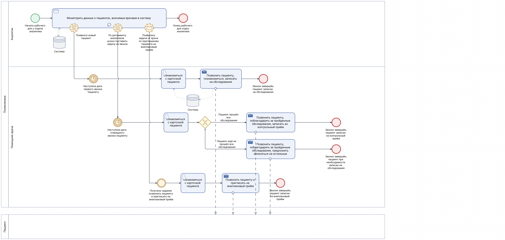
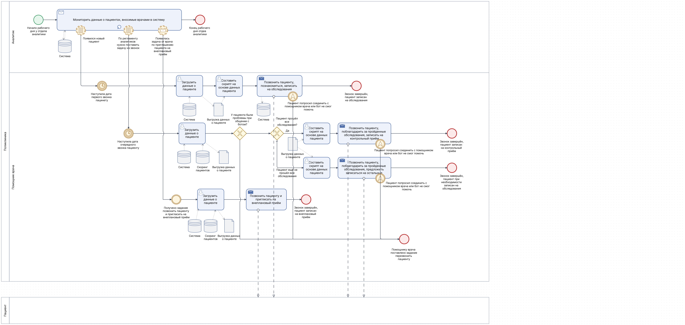
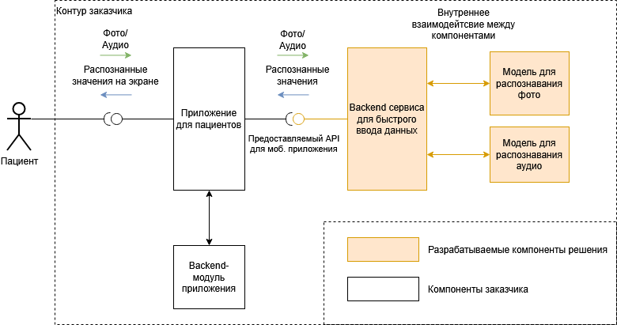
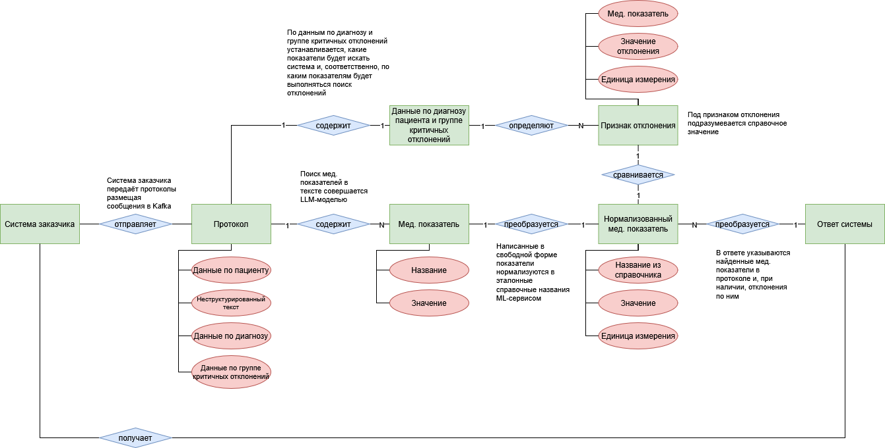

## Задача
Проекты для автоматизации задач с помощью ИИ для заказчика в медциинской сфере.

## Моя роль
 Описыавал бизнес-процессы с помощью BPMN и готовил концепты решений. Проводил интервью заказчиков.
 По взятому в работу треку готовил ТЗ, функциональные и нефункциональные требования. Ставил задачи в Jira, сопровождал разработку, вёл рабочую коммуникацию с заказчиками.

## Артефакты
### BPMN-диаграммы для описания процесса AS IS работы помощника врача и процесса TO BE с применением бота

### Контекстная диаграмма системы распознавания значений с мед. оборудования

### ER-диаграмма предметной области для системы по поиску мед. показателей в протоколах обследований пациентов

## Инструменты
draw.io, Confluence