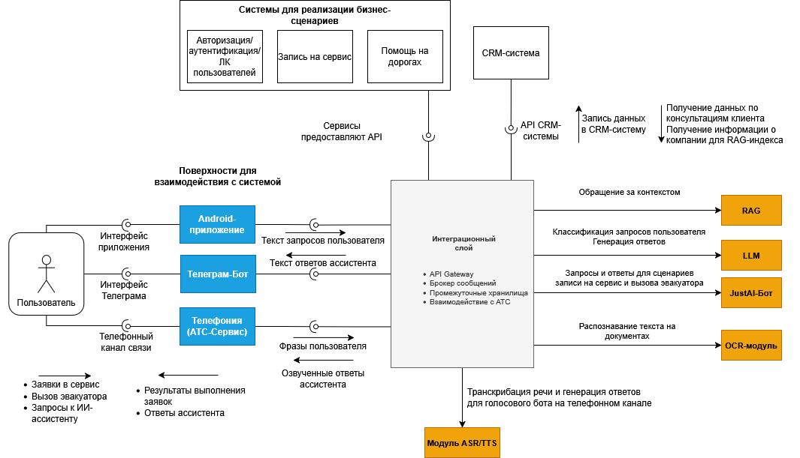

## Задача
Проект по созданию системы, объединяющую умного ассистента, голосового бота, телефонию и клиентское приложение для заказчика из сферы техобслуживания

## Моя роль
* Проводил интервью заказчиков
* Описывал функциональные и нефункциональные требования
* Описывал пользовательские сценарии
* Готовил артефакты - контекстную диаграмму и ТЗ для заказчика

## Артефакты

- [Исходный файл диаграммы](./diagrams/multi-modal-assistent.drawio)