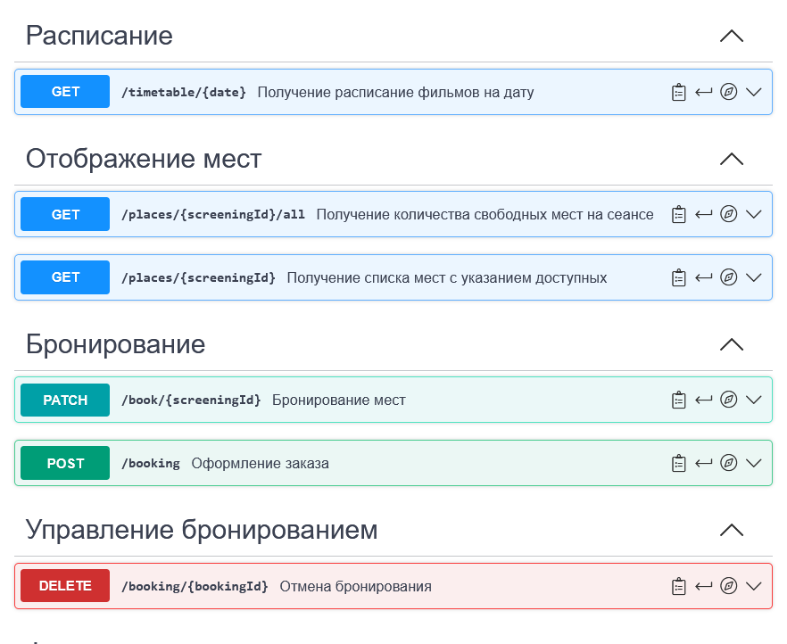
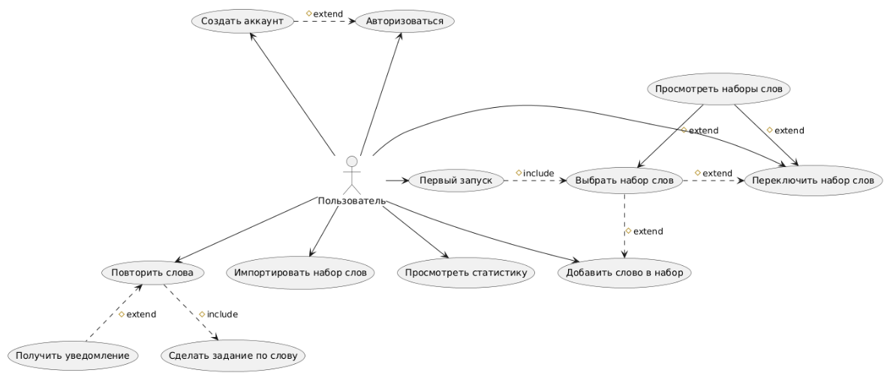
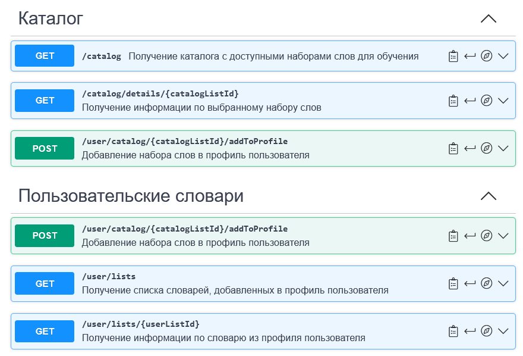
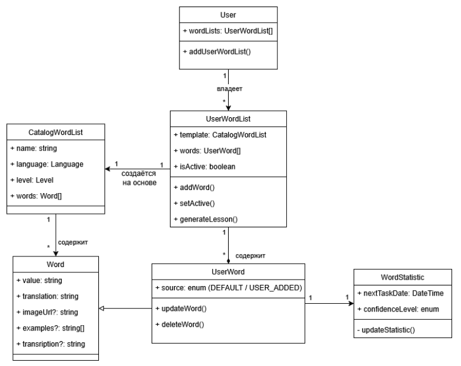

# Учебные проекты

Примеры артефактов, выполненных в рамках профессиональной переподготовки и самообразования.

**2025 | Нетология | Программа "Системный аналитик PRO**

---

## Cinema Booking API
**OpenAPI 3.0 | REST | YAML**

Спецификация API для системы бронирования билетов в кинотеатр.

### Артефакты
- [openapi.yaml](./cinema-booking-api/openapi.yaml) — полная спецификация
- [Ссылка на Swagger](https://app.swaggerhub.com/apis/novis2/IskorkaCinema2/1.0.0)

Пример документации эндпоинтов бронирования в Swagger UI:  

### Кратко о модели
- **Используются сущности**: Сеансы (`screenings`), Места `(places`), Бронирования (`bookings`)
- **Эндпоиниты**: Получение расписания и списка мест, CRUD для бронирований, функции администратора
###  Ключевые особенности
- **Статусы мест**: `available` / `booked` / `occupied`
- **Конфликты при бронировании**: ответ `409` со списком недоступных мест
- **Разграничение прав**: `403` при попытке изменить сеанс без прав администратора
- **Пагинация**: параметры `page`, `pageSize` в списках

---

## Vocabulary Learning App API
**OpenAPI 3.0 | REST | YAML | PlantUML**

Спецификация API для приложения "Слово дня" для заучивания иностранных слов в режиме интервального повторения

### Диаграмма вариантов использования

### Артефакты API
- [openapi.yaml](./vocab-app-api/openapi.yaml) — полная спецификация
- [Ссылка на Swagger](https://app.swaggerhub.com/apis/NOVIS2_1/WordOfTheDay/1.0.0)

Пример документации эндпоинтов приложения в Swagger UI:  

Диаграмма классов  

### Кратко о модели
- Сущности: пользователи, наборы слов для обучения, пользовательские копии наборов слов, слова
- Endpoints: просмотр каталога наборов слов и добавление набора в профиль, управление пользовательским набором, CRUD для слов, получение урока и отправка результатов урока, просмотр статистики
### Ключевые особенности
- **Фильтры каталога**: язык (6 вариантов), уровень (4 уровня)
- **Интервальное повторение**: статусы `new/learning/learned/mastered/forgotten`, расчёт `nextPracticeTime`
- **Защита данных**: запрет на изменение/удаление слов из системных наборов (`403`, флаг `userAdded`)
- **UUID для сущностей**: `userWordId` в формате UUID
- **Опциональные поля**: `transcription`, `audioUrl`, `imageUrl` (nullable)

---

> **Планируется добавить**: текстовые описания требований, диаграммы классов, примеры сценариев использования.
